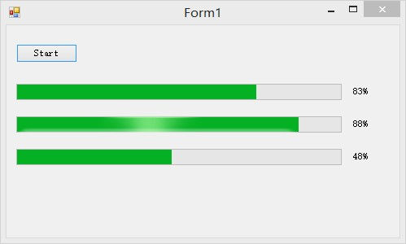
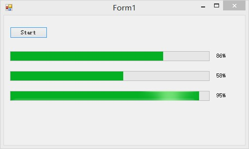
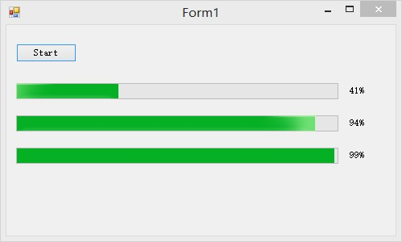

# Readme

## 运行截图

## 运行环境
- 装有.NET Framework 4.0或以上的电脑
- 最好是64位Windows系统
- 本程序在Windows 8.1 + VS2013 + .NET Framework 4.5上运行通过

## 运行向导
1.  打开`Lab 5.sln`
2.  运行程序即可

## 实现过程
使用`System.Threading.Timer`来进行Timer的Callback。对于每一个ProgressBar进行`MethodInvoker`的委托，具体查看代码。

## 关于我
- 博客: [Cee‘s Home](https://chu2byo.me)
- Github: [Cee's Github](https://github.com/cirnocee)